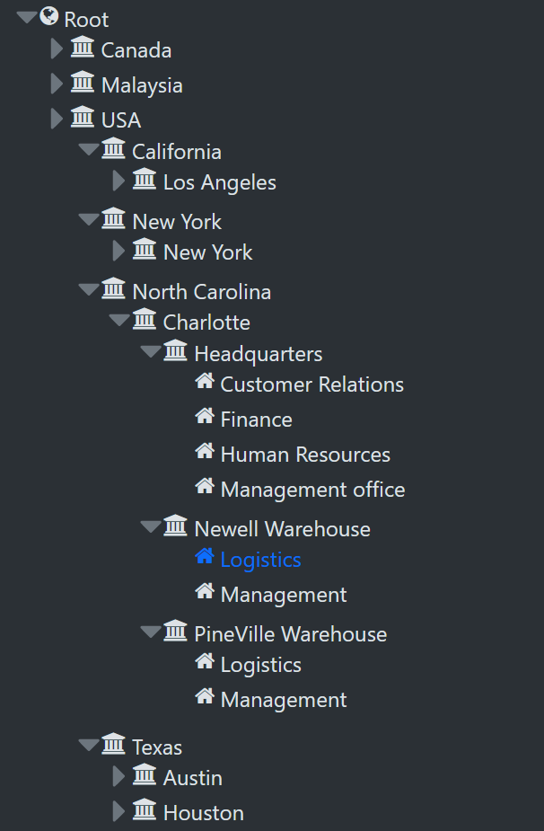
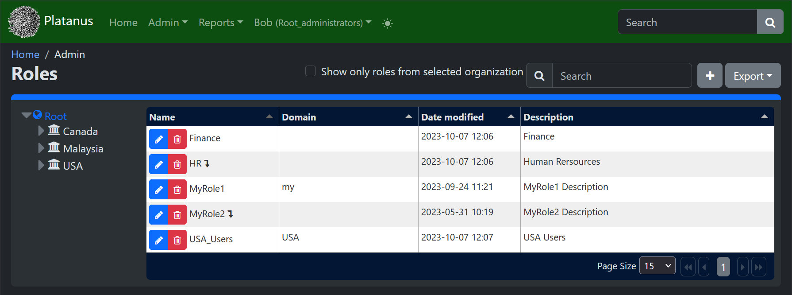
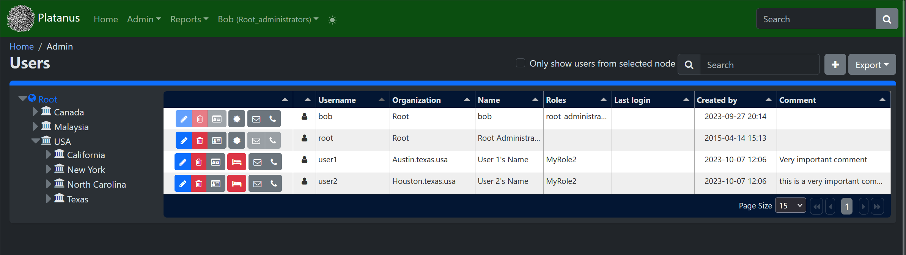
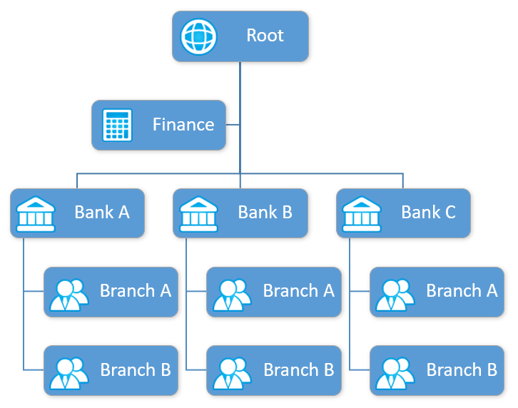
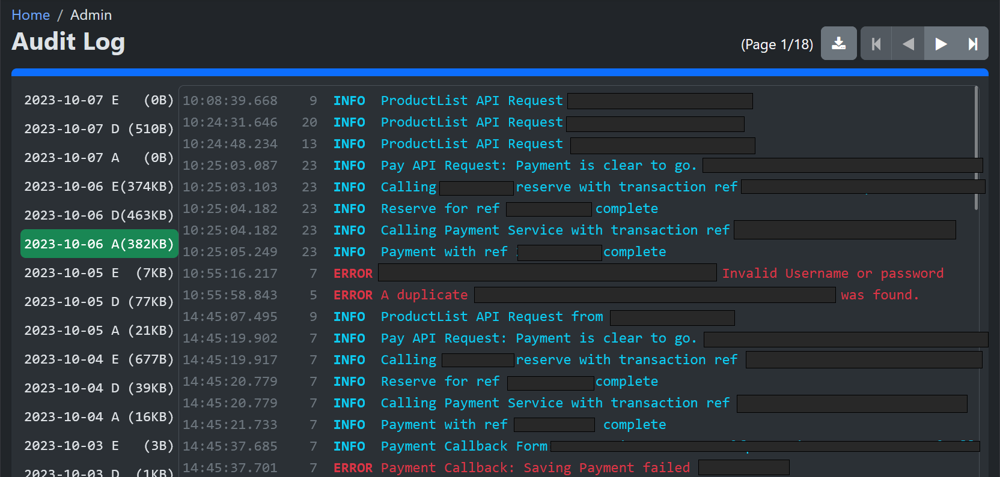
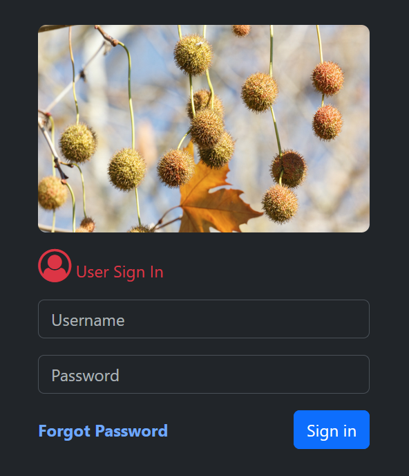
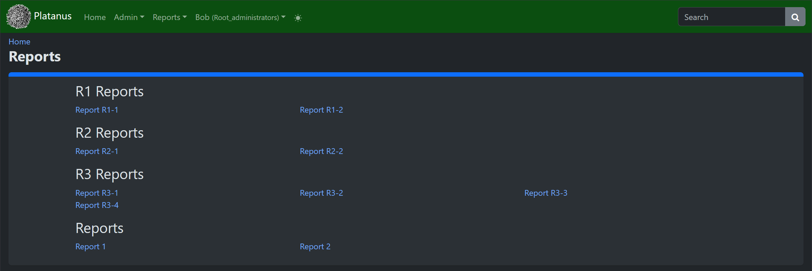
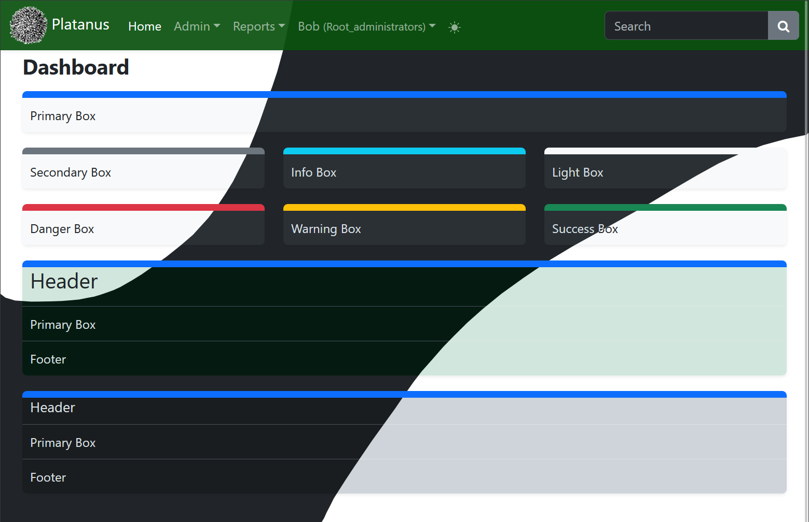

# Introduction
Plane tree is designed to allow fast prototyping of a fully functional enterprise level application. It is designed to require minimal expertise in at least one programming language (C#, PHP, Java, JavaScript, Kotlin, SQL, HTML, JavaScript, CSS) to be able to join a small team of developers, typically 3 developers (one for backend, one database design and one for frontend of choice) ) and build huge applications. For web UI minimum skills required are HTML, CSS and Java script (and jQuery). For advanced Web UI development React.js, Angular, Vue.JS or Blazor can be used.

This framework exists in 4 backend programming language of C# (4.8 and Core), Java, JavaScript (Node.JS) and PHP which since signature and communication protocols between backend and UI is same all GUIs (Android, Windows, Web) will work with any of those. Bootstrap is used as standard Web UI Interface. This framework eases User authentication with its runtime (and develop time) customizable and easy to manage interface. Runtime permission management with full organization tree support allows configuring role and user permissions at runtime which in turn will let software developers to only concentrate on application logic instead of deciding who will have permission to what.
Note: Java and JavaScript (Node.JS) backend are not open source yet (but will be soon, stay tuned)

Note: You might find traces of SSO (Single Sign On), Active Directory User Management, NoSQL, Redis Cluster, Load Balancing in the code. These are not planned to be open source in near future and these functionality will be removed from open source, if found, so if you are using the open source version, do not rely on these functionality.

# How easy is it to use?
## Create a REST API
To create a REST (or RESTful) service start with a class implementing IService

**PHP**
```php
class endpoint implements IService {
}
```
**C#**
```c#, Java
public class endpoint: IService {
}
```

Then add your API methods with following signature which will be a publicly accessible REST service with Json output

**PHP**
```php
public function index(array $request, user $user): string {
    $Array = ['message':'hello!'];
    return json_encode($Array, JSON_ENCODE_OPTIONS);
}
```

**C#**
```c#
public string method(JSONNode Request, User user) {
    string JsonString = "{\"message\":\"hello!\"}"
    return JsonString;
}
```

To force permission check to access your API, decorate your REST method with following

**PHP**
```php
#[authenticate("Title")]
```
**C#**
```c#
[Authenticate("Title")]
```
**Java**
```java
@Authenticate("Title")
```

**Note:**  Classes that are not implementing `IService` interface, and  non-`public` methods in classes that implement `IService`  will not be accessible as API. This is a seurity feature to make sure no method outside what is allowed to be API is called as API from client

## Create a WEB UI Page

To add a Web page GUI create an html file in HTML folder which will be publicly accessible. Start your html file with following content

```html
<!DOCTYPE html>
<html lang="en">
<head>
    <meta charset="utf-8"/>
    <meta http-equiv="content-type" content="text/html; charset=utf-8">
<title>Page Title</title>
    <!--%%HEADER-->
<style>
</style>
    <script type="text/javascript">
    </script>
    <!--HEADER%%-->
</head>
<body>
    <!--%%BODY-->
    <!--BODY%%-->
</body>
</html>
```

To automatically show a menu link to this page in your application menu, add following before header identifier tag

```html
<meta name="menu" content="order=80;icon=fa fa-file-text-o;title=Page Title"/>
```
And to use specific template for that web page, use following 
```html
<meta name="template" content="template name"/>
```

Then add your content into body identifier (`<!--%%BODY-->` and `<!--BODY%%-->`) and your JavaScript and CSS to header identifier.

To force permission check to access that page change file extension from `.html` to `.auth.html`.

## Multi Language API, Interface
To use translation functionality, add language translation dictionary into its folder, then in your code. Use translation markers like `##TRANSLATE_THIS##` and it will be translated to user's language (if set), otherwise to Website default language.

**Note:** Assets and static contents are not translated but this is easily implementable in Form UI (Android, Windows Desktop) and Web (Using JavaScript and Translation array returned from an API)

## Initial Setup
Initial configuration of application is a little different between languages (due to limitation of each language processor and platform requirement)

- For PHP change config.php file.
- For other languages .NET and Java, Node.JS after installing app in your Webserver, navigate to https://YourApplicationDomain/setup/

**Note:** In future version configuration of PHP will be like other languages too.
  
## Adding Organization, Roles and Users.
### Create Organizations

<p align="center">

</p>

Users and roles are arranged in Organization tree to allow hierarchical management (refer to more explanation below). If Organization uses flat hierarchy, only root organization will be enough and data management will be drastically easier to handle.

Create as many organization unit as required, and asign them to a parent or root. Later this will define what abilities and data user can access.

**Norte:** If your system is using Active directory, it is possible to import Organization tree from Active directory.

**Norte:** If your system is using SSO (Single Sign On) Organization Tree is configures in SSO Main and SSO Clients are not required to configure Organization Tree anymore

### Create Roles

<p align="center">

</p>

Each user need a role to be able to access system (tough this is overridable in certain conditions).

Create as many roles as required under each organization unit or inherit roles from organization nodes above in the tree. Permissions for each role will be visible in tree format allowing to give permission to a certain task all together or granular.

**Norte:** If your system is using Active directory, Roles will be imported from Active directory and only permission for each role is editable

**Norte:** If your system is using SSO (Single Sign On), role permissions are configured in SSO Main and SSO Clients are not required to configure Role permissions.

### Create Users

<p align="center">

</p>

Create users under organization units and Assign them a role to inherit its permissions. alternatively in some cases a certain user will require a permission not common to role and you can assign it using explisit permissions.

**Note:** Users are by default created as inactive, so you will need to approve them before they are able to access system.

**Norte:** If your system is using Active directory, Users and their roles are imported from Active Directory and only their explisit permissions are configurable.

**Norte:** If your system is using SSO (Single Sign On), Users are configured in SSO Main and SSO Clients are not required to configure users.

## Using Other UI Frameworks.
This application relies on Single Web pages to manage user access, thus if you are using a single page framework such as react.js, vue.js, angular.js you will need to create a separate page for each permission required. REST API endpoints are not affected.

## Load Balancer
A simple Round robin Load Balancer with activate/disable node configuration is implemented in system. Users will be forwarded to one of available servers after login. An internal reserved node can be configured to allow specific users such as administrators to access system. It is possible to Load balance the login screen too. A IP White List and Black List is implemented in system to allow Administrators block or white list an IP (or Range by mask, subnet). 

# Framework Features
## Organization tree
Locations/Offices/ branches and Organization units are organized in an organization tree. This tree defines relation of departments in system. It is also used to arrange users in tree structure so their permission to interact with data is setup accordingly. 

<p align="center">

</p>

Referring to chart above, Users from Bank A have access to all information from branches below them but not information from Bank B, Bank C or branches under them. Data available to Finance department is not available to either of banks, unless the rule is overridden for some API access. Same applies to Branch a data which is not visible to Branch B but data for both branches are available to Bank level nodes above them. This is achieved by two set of permissions checking, Access Permission and Record Filtering.

Access permission can be set by role permissions or explicit user permissions. If a user have access to see a type of information they will be able to see that type of information regardless of their position in organization tree. Role or user access permissions, can be changed anytime during life time of application by user admins.

Record filtering allows some information selectively be visible to nodes and others stay hidden. The information available to each node is decided during design phase of each application and cannot be changed at run time. For example a user at root level will be able to transaction records for all nodes below but a user from Bank A who has access to that same type of data can only see data for their own organization unit and units below.

System admins can create new organization nodes at any time. Only a basic set of essential information is stored in Organization node record. 


## Audit
<p align="center">

</p>

1.	All user activities should have at least one line of audit which explains the user action. 
1.	Audit log should be stored by date and if amount of log created is too much to store in a single file per day to be accessed easily, then it can be split to multiple files. This is hard configured for each application separately and cannot be changed by system admins.
1.	Audit Logs need to be signed and archived every day.
1.	Audit logs are write only and cannot be edited.
1.	Options for storing audit logs are file or database. File system is preferred.
1.	Audit logs should be available as read-only from application UI for inspection for whoever has access to see them (usually personnel from root node).
1.	It is not required to filter log by organization nodes, however it is preferred.
1.	Audit personnel need to be able to download Audit logs at any time if they have permission to do so. Audit logs can be downloaded in 2 formats of PDF or raw text. 
1.	If application using security module is able to provide PDF signing facilities, PDF downloads need to be signed.
1.	Audit personnel should be able to access audit logs for past n days from application UI. Total days available is hardcoded in every application and cannot be changed. More audit logs should be available by requesting from system admins, since Audit logs should not be deleted for next 7 years.
1.	No critical information is allowed to save in Audit logs, such as user passwords, credit card, Account and phone numbers. If such kind of log is required, it should be in a separate log and stored encrypted and only available to personnel authorized by requesting from system admins.
1.	View, Create, Delete and Change nodes each should have a separate permission.

## Role management
1.	Roles are defined under each organization node and during creation can be set to be visible to nodes below or only the current node. Roles defined in a node, are always visible to nodes above.
1.	Nodes cannot see roles defined in their sibling node. 
1.	Upper nodes are allowed to delete roles from lower nodes. To do this, user need to have the permission to delete roles.
1.	System admin are be able to select a node in organization tree and see all roles visible to that node and/or all roles defined in nodes below if a checkbox is checked.
1.	Roles can be searched by name and description
1.	Once role created, only its permission and description can be modified.
1.	Deleting a role requires removing all users from it beforehand.
1.	System admins can modify role permissions at any time and it will take effect immediately.
1.	All system admin activities in role management page are logged in audit.
1.	Roles names are unique but their descriptions are not 
1.	When showing name of a role it includes its locations in organization tree too (e.g. administrators@root)
1.	A role that is available to nodes below will be marked with an arrow showing that it is visible to organization nodes below which means users can be assigned to that role on all tree branches below (e.g. Operators@root*) but this will not override data availability for each organization node.
1.	View, Create, Delete and Change Roles each have a separate permission.
1.	When editing a role, Permissions defined in application modules are listed in tree form for improved UX.

## Login process

<p align="center">

</p>

1.	Login process can be configured for system to be Single or Two Step during initial application setup and can be changed later.
1.	With two step login a picture that user will select during their first login will be shown to them for security purpose. This image is required following security standards and does not reveal its URL or user settings.
1.	A Captcha code can be shown during login, and can be disabled / enabled from system configuration. Since some applications run on Intranet without internet access, Google captcha is not used.
1.	On connection request from client, a white list / black list is checked and only users from allowed IPs are able to connect. White list and black list are configurable from setup screen.
1.	On connection request, user certificate is verified. Information from certificate will be checked to conform requirement for that specific user or their organization unit to verify that user is allowed to login from organization identified by certificate. This rule can be enabled/disabled from setup. Client certificate is installed on user machine. Binding of user to certificate is configured from user management screen and requires specific permission to modify.
1.	A user cannot login from 2 device. If a user login from second device, his session from first device will expire.
1.	 Password complexity is configurable in setup
    -	How many lower case characters
    -	How many uppercase characters
    -	How many numeric characters
    -	How many sign characters
    -	Minimum Length of password
1.	Minimum and maximum length of password is configured from system settings screen.
1.	For added security, password is both salted and hashed before storing in database.
1.	If user does not login to system for a period of time after their account created, their account will be locked and require management to unlock it again. Lockdown delta can be changed from setting screen.
1.	If user does not login for a period of time, their account will be locked. This period is adjustable from settings screen and account can only be unlocked by a user with user management permission.
1.	If user account stays locked for a period of time, their account will be deleted. This can be disabled from settings screen or set to a period of time in days.
1.	On first login, if two step login is enabled, users will be redirected to a settings page to select their security image. Users will not be able to use website until they set this image. Also users are able to change this security image anytime they wish by accessing same screen.
1.	Password expiry can be adjusted in setup. If enabled from settings, users are required to change their password after period of time set in setup page. Based on setting in system, users are not allowed to enter website before changing their password or this can only be advised. New users are required to change their password on first login
1.	If user session is expired, they will be redirected to login screen and once they login they will be redirected back to previous page to continue their work. 
1.	User login periods can be limited to hours of day, and days of week, this is enabled/disabled from settings but it is configurable for each role, user. Use of this feature can only be enabled during development and customer cannot change this setting.
1.	User login can be limited to a date range (e.g. from 2023-01-01 to 2025-01-01). Users will be locked before and after this date. This feature can be enabled/disabled in settings but period can be configured per user. Use of this feature can only be enabled during development and customer cannot change this setting.
1.	Manager users can transfer their permissions to users in their organization or nodes below for a period of time. This permission will expire after mentioned period of time and users with transferred permissions will not have access to those permissions anymore. Use of this feature can only be enabled during development and customer cannot change this setting.

## Reports

<p align="center">

</p>

Reports are identified and listed under reports menu item if they are placed in report folder of HTML. This is a Web UI Only feature. If user does not have permission to see a report, it will not be listed for them.

## Dashboard
A fully customizable dashboard exist in the system which allows users to select theme, colors and widgets to be shown to them after login and resize the widgets. Users can click on widget toolbar to open them as a page or temporarily maximize them


<p align="center">

</p>

**Note:** At the moment this widget is using a paid component thus cannot be included in open source, however I'm modifying the code to remove its dependency to paid component and use open source instead.

**Note:** This is a Web UI only dashboard and does not exists in Android and Windows applications.

**Note:** At the moment only on of each dark and light themes are included in the code as page template. More will be added when Paid component is removed from the code.

